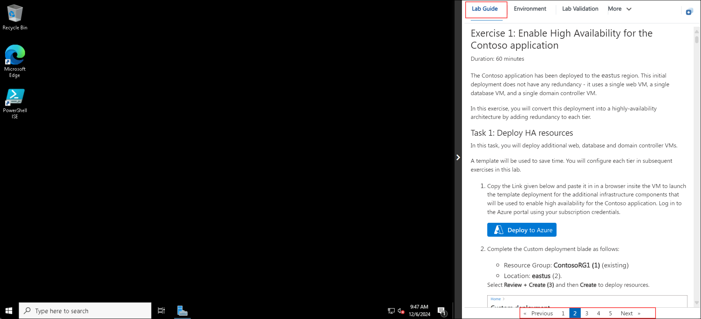
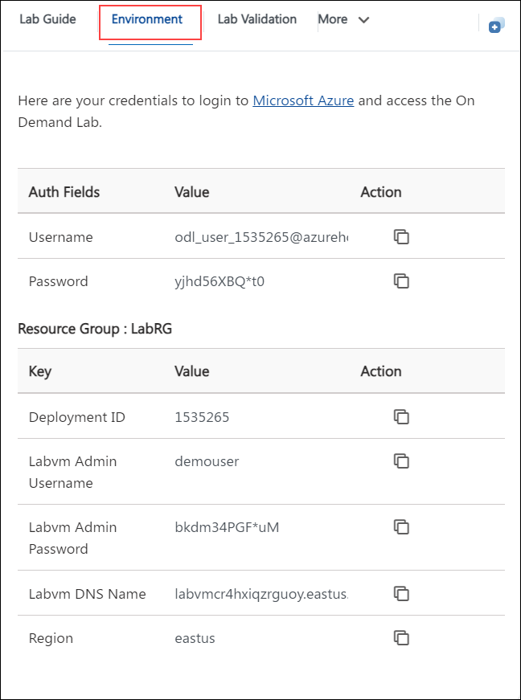
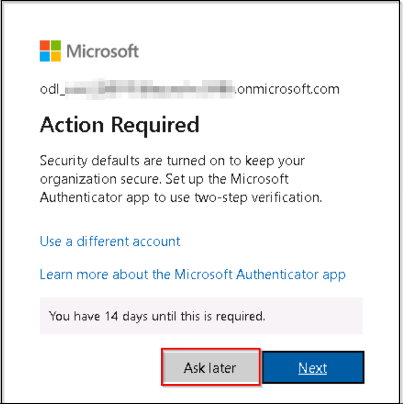

# Building a Resilient IaaS Architecture
### Overall Estimated Duration: 8 Hours

## Overview
Building a Resilient IaaS Architecture lab focuses on improving the reliability of the Contoso application by implementing Azure solutions for high availability, disaster recovery (DR), and data protection. High availability is achieved by adding redundancy across the web, database, and domain controller tiers. A secondary DR site is then configured using appropriate Azure technologies for each tier to ensure business continuity. Azure Backup is employed to safeguard the web tier virtual machines and the SQL Server database. Finally, the lab concludes by validating the high availability, DR, and backup configurations to ensure the application’s resiliency and preparedness for potential failures.

## Objective
The objective of this lab is to enhance the Contoso application’s reliability by implementing high availability, disaster recovery (DR), and backup solutions in Azure. This includes adding redundancy, configuring a secondary DR site, and securing data with Azure Backup. The goal is to validate these solutions to ensure system resiliency and continuity.

- **Enable High Availability for the Contoso application:** In this exercise, you will deploy additional web, database and domain controller VMs you will convert this deployment into a highly-availability architecture by adding redundancy to each tier.

- **Enable Disaster Recovery for the Contoso application:** In this exercise, you will enable a secondary DR site. This site will support each tier of the Contoso application, using a different technology in each case. The DR approach is summarized in the following table.

- **Enable Backup for the Contoso application:** In this exercise, you will use Azure Backup to enable backup for the Contoso application. You will configure backup for both the web tier VMs and the SQL Server database.

- **Validate resiliency:** In this exercise, you will validate the high availability, disaster recovery, and backup solutions you have implemented in the earlier lab exercises.

## Prerequisites

Participants should have a basic understanding of the following:

- **Azure Portal Navigation:** Experience navigating the Azure portal for managing resources.
- **Azure Site Recovery:** Understanding of Azure Site Recovery concepts and operations.
- **SQL Server Management:** Understanding of SQL Server concepts and operations.
- **Networking Basics:** Familiarity with creating SMB shares and managing network configurations.
- **Azure Front Door:** Knowledge of Azure Front Door architecture, features, and operations.

## Architecture
In this high availability and disaster recovery architecture, **Azure resources** are deployed to configure **High Availability (HA)** for the **Domain Controller**, **SQL Server**, and **Web tiers**, ensuring resilience and fault tolerance. **Disaster Recovery (DR)** resources, such as **Azure Site Recovery**, are implemented to enable failover capabilities, while a public endpoint is configured using **Azure Front Door** for global accessibility. Additionally, **Azure Backup** resources are set up to protect data for the **Web tier** and **SQL Server tier**. Advanced tasks include validating HA configurations, performing region-to-region disaster recovery failback for **IaaS**, and verifying the integrity of **VM backups** and **SQL backups**, ensuring operational continuity and robust recovery mechanisms.

## Architecture Diagram

## Explanation of Components
The architecture for this lab involves the following key components:

- **Azure Migrate:** A service that helps assess and migrate on-premises workloads to Azure, providing tools for discovery, assessment, and migration.
- **Azure SQL Database:** A fully managed database service that provides scalability, security, and high availability for SQL workloads in the cloud.
- **Azure SQL Managed Instance (SQL MI):** Offers near 100% compatibility with the SQL Server engine and is designed for easy migration of existing SQL Server workloads to Azure.
- **Azure App Service:** A fully managed platform for building, deploying, and scaling web apps and APIs.
- **SMB Network Share:** A file-sharing protocol used to create shared folders for backups or data transfer in the migration process.

## Getting Started with Your Migrate and Modernise SQL Servers to Azure Hands On Lab
Welcome to your Migrate and Modernise SQL Servers to Azure Hands On Lab! We've prepared a seamless environment for you to explore and learn about Azure services. Let's begin by making the most of this experience:

## Accessing Your Lab Environment
 
Once you're ready to dive in, your virtual machine and **Lab Guide** will be right at your fingertips within your web browser.
 

## Virtual Machine & Lab Guide
 
Your virtual machine is your workhorse throughout the workshop. The lab guide is your roadmap to success.
 
## Exploring Your Lab Resources
 
To get a better understanding of your lab resources and credentials, navigate to the **Environment** tab.
 

 
## Utilizing the Split Window Feature
 
For convenience, you can open the lab guide in a separate window by selecting the **Split Window** icon at the top right corner.

 
## Managing Your Virtual Machine
 
Feel free to start, stop, or restart your virtual machine as needed from the **Resources** tab. Your experience is in your hands!
 

 
## Let's Get Started with Azure Portal
 
1. On your virtual machine, click on the Azure Portal icon as shown below:
 
        

1. You'll see the **Sign into Microsoft Azure** tab. Here, enter your credentials:
 
   - **Email/Username:** <inject key="AzureAdUserEmail"></inject>
 
     
 
1. Next, provide your password:
 
   - **Password:** <inject key="AzureAdUserPassword"></inject>
 
     

1. If you see the pop-up **Action Required**, keep default and then click on **Ask later**. If you see the pop-up Help us protect your account, click on **Skip for now**(14 days until this is required), and then click on **Next**.

     

   >**NOTE:** Do not enable MFA, select **Ask Later**.
 
1. If prompted to stay signed in, you can click **No**.

     
 
1. If a **Welcome to Microsoft Azure** pop-up window appears, simply click **Maybe Later** to skip the tour.
   

## Support Contact
The CloudLabs support team is available 24/7, 365 days a year, via email and live chat to ensure seamless assistance at any time. We offer dedicated support channels tailored specifically for both learners and instructors, ensuring that all your needs are promptly and efficiently addressed.

Learner Support Contacts:

   - Email Support: cloudlabs-support@spektrasystems.com
   - Live Chat Support: https://cloudlabs.ai/labs-support
   
Now you're all set to explore the powerful world of technology. Feel free to reach out if you have any questions along the way. Enjoy your workshop! 

Now, click on **Next** from the lower right corner to move to the next page.

   

### Happy Learning!!
